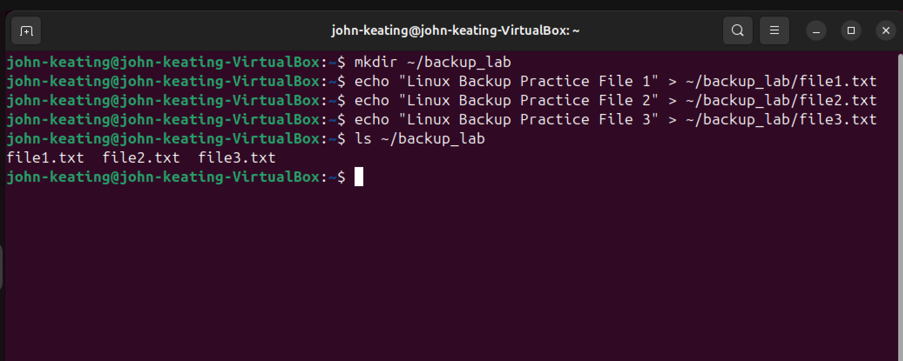
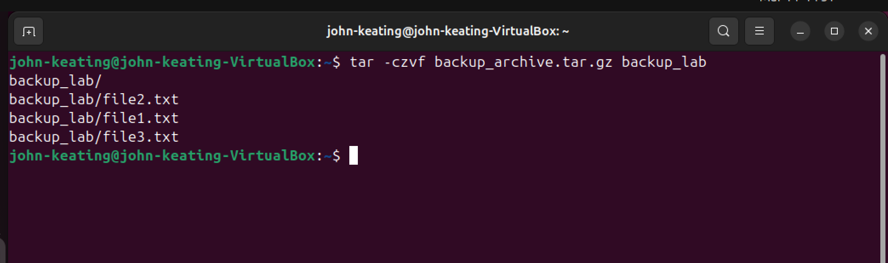
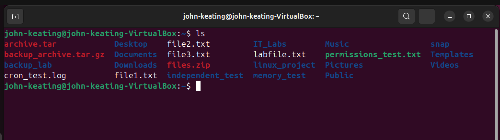
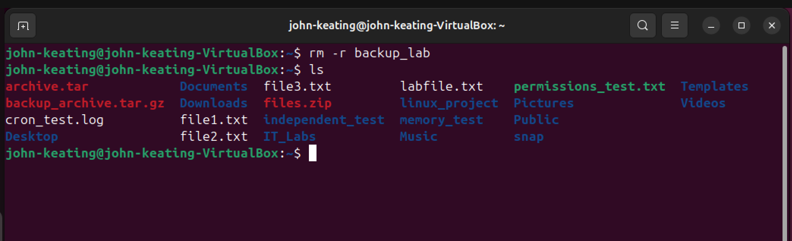
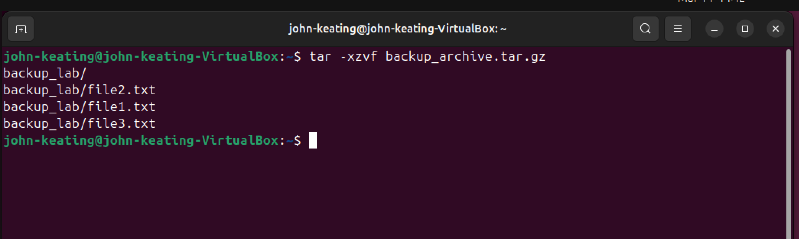

# Linux Backup and Restore Lab

## Objective

The purpose of this lab is to learn how Linux administrators create backups and restore data using the **tar archiving utility**.

Backups are critical in real-world environments because data can be lost due to:

- Accidental deletion
- Hardware failure
- Corrupted files
- Ransomware attacks
- System crashes

In this lab I practiced:

- Creating files for backup
- Archiving files with `tar`
- Compressing the archive with `gzip`
- Simulating data loss
- Restoring files from a backup archive

This demonstrates a **core Linux administration skill** used in DevOps, Cloud Engineering, and Cybersecurity.

---

# Environment

System Used

- Ubuntu Linux Virtual Machine
- Oracle VirtualBox
- Bash Terminal
- Windows Host Machine
- GitHub Lab Repository

Hardware

- Lenovo ThinkPad P16 Gen 2
- Intel i9 CPU
- 128 GB RAM
- NVIDIA RTX 4000 Ada GPU

---

# Commands Used

| Command | Purpose |
|------|------|
| `mkdir` | Creates a directory |
| `echo` | Writes text into a file |
| `ls` | Lists files and directories |
| `tar` | Archives and compresses files |
| `rm` | Removes files or directories |
| `clear` | Clears the terminal screen |

---

# Command Definitions

## mkdir

Command used:

```
mkdir ~/backup_lab
```

Definition:

`mkdir` means **make directory**.  
It creates a new folder in the Linux filesystem.

Explanation:

- `~` represents the current user's home directory
- `/backup_lab` is the name of the directory being created

Result:

A directory called **backup_lab** is created.

---

## echo

Commands used:

```
echo "Linux Backup Practice File 1" > ~/backup_lab/file1.txt
echo "Linux Backup Practice File 2" > ~/backup_lab/file2.txt
echo "Linux Backup Practice File 3" > ~/backup_lab/file3.txt
```

Definition:

`echo` prints text to the terminal or writes text into a file.

Symbol breakdown:

| Symbol | Meaning |
|------|------|
| `"` | Defines a text string |
| `>` | Redirects output into a file |
| `/` | Separates directories in a file path |

Example explanation:

```
echo "Linux Backup Practice File 1" > ~/backup_lab/file1.txt
```

This command:

1. Prints the text
2. Redirects the output into a file
3. Saves the file inside the backup directory

Result:

Three text files were created.

---

## ls

Command used:

```
ls ~/backup_lab
```

Definition:

`ls` stands for **list directory contents**.

It displays files and folders inside a directory.

Result:

```
file1.txt
file2.txt
file3.txt
```

---

# Creating the Backup Archive

Command used:

```
tar -czvf backup_archive.tar.gz backup_lab/
```

Definition:

`tar` is a Linux tool used to **combine multiple files into a single archive**.

It is commonly used for:

- System backups
- Log archiving
- File transfers
- Application packaging

---

# tar Flag Breakdown

| Flag | Meaning |
|-----|-----|
| `-c` | Create a new archive |
| `-z` | Compress archive using gzip |
| `-v` | Verbose output (shows files being processed) |
| `-f` | Specifies the archive file name |

Explanation:

```
tar -czvf backup_archive.tar.gz backup_lab/
```

Step-by-step meaning:

- Create a new archive
- Compress the archive
- Display the files being added
- Name the archive `backup_archive.tar.gz`
- Include everything inside `backup_lab`

Result:

A compressed backup file was created.

---

# Simulating Data Loss

Command used:

```
rm -r backup_lab
```

Definition:

`rm` means **remove**.

It deletes files or directories.

---

# rm Flag Breakdown

| Flag | Meaning |
|-----|-----|
| `-r` | Recursive deletion (removes folder and all contents) |

Explanation:

```
rm -r backup_lab
```

This command deletes:

- The folder
- All files contained within it

Result:

The original files were removed from the system.

---

# Restoring the Backup

Command used:

```
tar -xzvf backup_archive.tar.gz
```

Definition:

This extracts files from the backup archive.

---

# Restore Flag Breakdown

| Flag | Meaning |
|-----|-----|
| `-x` | Extract files |
| `-z` | Decompress gzip archive |
| `-v` | Display extracted files |
| `-f` | Specifies archive file |

Result:

```
backup_lab/
backup_lab/file1.txt
backup_lab/file2.txt
backup_lab/file3.txt
```

The deleted files were successfully restored.

---

# Screenshot Evidence

## Screenshot 1
Test files created



---

## Screenshot 2
Backup archive created



---

## Screenshot 3
Backup archive verified



---

## Screenshot 4
Original files deleted



---

## Screenshot 5
Backup restored



---

## Screenshot 6
Restore verified


---

# What I Learned

In this lab I learned how Linux administrators protect data using backup archives.

Key concepts learned:

- Creating directories and files
- Using `tar` to archive data
- Compressing backups with gzip
- Simulating data loss
- Restoring files from a backup archive

These skills are used in:

- Linux System Administration
- DevOps
- Cloud Infrastructure
- Cybersecurity Recovery

---

# Real World Use Cases

## Server Backup Example

```
tar -czvf server_backup.tar.gz /var/www
```

This archives an entire web server directory.

---

## Log Backup Example

```
tar -czvf logs_backup.tar.gz /var/log
```

This compresses system log files.

---

## Disaster Recovery

If files are deleted or a server fails, administrators restore the archive to recover the system.

---

# Lab Summary

This lab demonstrated the full Linux backup workflow:

1. Create files
2. Archive files
3. Compress the archive
4. Simulate data loss
5. Restore the backup

Backup and recovery are **essential Linux administration skills used in enterprise environments**.
